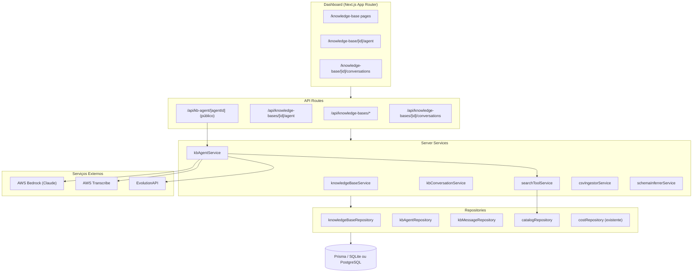
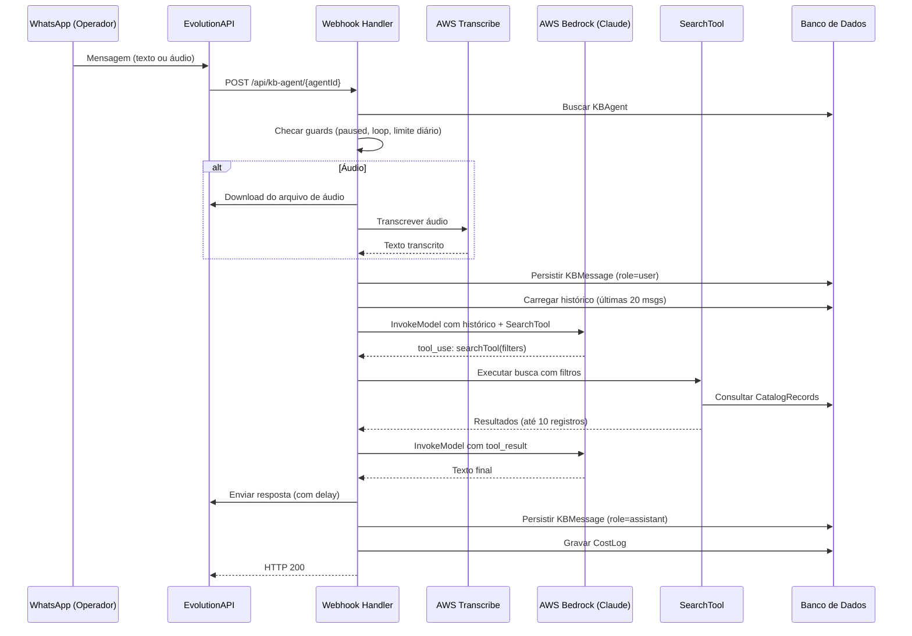

# Documento de Design: Agente IA com Base de Conhecimento Proprietária

## Visão Geral

O módulo **Knowledge Base Agent** estende a plataforma MKT Digital com a capacidade de cada empresa cliente conectar um catálogo de dados estruturado (imóveis, produtos, veículos, serviços etc.) a um agente de IA acessível via WhatsApp. O operador final envia mensagens de texto ou áudio; o agente transcreve o áudio quando necessário, extrai intenções e filtros usando Claude com _tool use_, consulta o catálogo via `SearchTool`, e responde em linguagem natural.

O módulo é **independente** do `whatsapp-ai-agent` existente, mas reutiliza toda a infraestrutura da plataforma: Next.js 16, Prisma, AWS Bedrock (Claude), EvolutionAPI, logger, errors e CostLog. A implementação segue os mesmos padrões arquiteturais estabelecidos: repositórios → serviços → API routes → páginas de dashboard.

### Escopo do Módulo

- Gerenciamento de KnowledgeBases, CatalogFields e CatalogRecords (CRUD + upload CSV)
- Configuração e ciclo de vida de KBAgents
- Webhook para processamento de mensagens de texto e áudio via WhatsApp
- Ferramenta de busca estruturada (SearchTool) invocada por _function calling_ do Claude
- Transcrição de áudio com AWS Transcribe
- Rastreamento de custos via CostLog
- Dashboard com visualização de conversas

---

## Arquitetura

### Diagrama de Componentes



### Fluxo de Processamento de Mensagem



### Decisões de Design Chave

**1. Bedrock Tool Use (Function Calling)**
O Claude suporta _tool use_ através do campo `tools` no payload da API Anthropic. Ao invés de um único `InvokeModel`, o webhook implementa um loop de ciclos:
- Ciclo 1: envia histórico + definição da `SearchTool`; Claude pode responder com `tool_use`
- Ciclo 2: envia `tool_result` com o resultado da busca; Claude responde com texto final
Tokens e custos são acumulados ao longo de todos os ciclos.

**2. SearchTool — Filtragem de JSON (SQLite vs PostgreSQL)**
O campo `CatalogRecord.data` é um JSON serializado como `string`. Para SQLite (desenvolvimento), a filtragem é feita em memória (JavaScript): todos os registros da KnowledgeBase são carregados e filtrados por campo. Para PostgreSQL (produção), pode-se usar operadores JSON nativos. A camada de serviço encapsula essa lógica; o repositório recebe os registros e o serviço aplica os filtros.

**3. AWS Transcribe — Batch vs Streaming**
Para áudios curtos do WhatsApp (< 300 s), usa-se `@aws-sdk/client-transcribe` com _batch job_ (StartTranscriptionJob + polling). O arquivo é enviado para o S3 antes da transcrição. Alternativamente, pode-se usar `@aws-sdk/client-transcribe-streaming` para menor latência, mas requer stream de bytes do áudio. A implementação usa batch para simplicidade, com polling com back-off exponencial.

**4. CSV Ingestor**
Usa a API de streams nativa do Node.js (`fs.createReadStream` + leitura linha a linha) sem bibliotecas externas. O parser divide por vírgulas respeitando aspas duplas (RFC 4180 básico). O `Schema_Inferrer` analisa as primeiras 20 linhas de dados para inferir tipos.

**5. Unicidade de instanceName**
O `instanceName` deve ser único por empresa considerando tanto `WhatsAppAgent` quanto `KBAgent`. A validação de conflito é aplicada no serviço, consultando ambas as tabelas.

---

## Componentes e Interfaces

### Camada de Repositório

```typescript
// src/server/repositories/knowledgeBase.repository.ts
interface KnowledgeBaseRepository {
  findByCompanyId(companyId: string): Promise<KnowledgeBase[]>;
  findById(id: string): Promise<KnowledgeBase | null>;
  create(data: CreateKBInput): Promise<KnowledgeBase>;
  update(id: string, data: UpdateKBInput): Promise<KnowledgeBase>;
  delete(id: string): Promise<void>;
  countByCompanyId(companyId: string): Promise<number>;
}

// src/server/repositories/catalog.repository.ts
interface CatalogRepository {
  // CatalogFields
  findFieldsByKBId(knowledgeBaseId: string): Promise<CatalogField[]>;
  createField(data: CreateFieldInput): Promise<CatalogField>;
  updateField(id: string, data: UpdateFieldInput): Promise<CatalogField>;
  deleteField(id: string): Promise<void>;
  countFieldsByKBId(knowledgeBaseId: string): Promise<number>;

  // CatalogRecords
  findRecordsByKBId(knowledgeBaseId: string, page: number, pageSize: number): Promise<{ records: CatalogRecord[]; total: number }>;
  findAllRecordsByKBId(knowledgeBaseId: string): Promise<CatalogRecord[]>; // para busca em memória (SQLite)
  createRecord(data: CreateRecordInput): Promise<CatalogRecord>;
  createManyRecords(data: CreateRecordInput[]): Promise<number>; // retorna count
  updateRecord(id: string, data: string): Promise<CatalogRecord>; // data = JSON string
  deleteRecord(id: string): Promise<void>;
  deleteAllRecordsByKBId(knowledgeBaseId: string): Promise<number>; // retorna count
  countRecordsByKBId(knowledgeBaseId: string): Promise<number>;
  removeFieldFromAllRecords(knowledgeBaseId: string, fieldName: string): Promise<void>;
}

// src/server/repositories/kbAgent.repository.ts
interface KBAgentRepository {
  findById(id: string): Promise<KBAgent | null>;
  findByKnowledgeBaseId(knowledgeBaseId: string): Promise<KBAgent | null>;
  findByCompanyId(companyId: string): Promise<KBAgent[]>;
  create(data: CreateKBAgentInput): Promise<KBAgent>;
  update(id: string, data: UpdateKBAgentInput): Promise<KBAgent>;
  toggleStatus(id: string): Promise<KBAgent>;
  delete(id: string): Promise<void>;
}

// src/server/repositories/kbMessage.repository.ts
interface KBMessageRepository {
  save(data: SaveKBMessageInput): Promise<KBMessage>;
  getHistory(agentId: string, remoteJid: string, limit?: number): Promise<KBMessage[]>;
  listConversations(agentId: string, page: number, pageSize: number): Promise<KBConversationSummary[]>;
  countTodayUserMessages(agentId: string, remoteJid: string): Promise<number>;
}
```

### Camada de Serviço

```typescript
// src/server/services/knowledgeBase.service.ts
export const knowledgeBaseService = {
  listByCompanyId(companyId: string): Promise<KnowledgeBase[]>;
  getById(userId: string, id: string): Promise<KnowledgeBase>;
  create(userId: string, companyId: string, input: CreateKBInput): Promise<KnowledgeBase>;
  update(userId: string, id: string, input: UpdateKBInput): Promise<KnowledgeBase>;
  delete(userId: string, id: string): Promise<void>;
  assertOwnership(userId: string, id: string): Promise<KnowledgeBase>;
};

// src/server/services/catalogField.service.ts
export const catalogFieldService = {
  listByKBId(userId: string, knowledgeBaseId: string): Promise<CatalogField[]>;
  create(userId: string, knowledgeBaseId: string, input: CreateFieldInput): Promise<CatalogField>;
  update(userId: string, fieldId: string, input: UpdateFieldInput): Promise<CatalogField>;
  delete(userId: string, fieldId: string): Promise<void>;
};

// src/server/services/catalogRecord.service.ts
export const catalogRecordService = {
  list(userId: string, knowledgeBaseId: string, page: number, pageSize: number): Promise<PaginatedResult<CatalogRecord>>;
  create(userId: string, knowledgeBaseId: string, data: Record<string, unknown>): Promise<CatalogRecord>;
  update(userId: string, recordId: string, data: Record<string, unknown>): Promise<CatalogRecord>;
  delete(userId: string, recordId: string): Promise<void>;
  deleteAll(userId: string, knowledgeBaseId: string): Promise<number>;
};

// src/server/services/kbAgent.service.ts
export const kbAgentService = {
  getByKBId(userId: string, knowledgeBaseId: string): Promise<KBAgent | null>;
  create(userId: string, knowledgeBaseId: string, input: CreateKBAgentInput): Promise<KBAgent>;
  update(userId: string, agentId: string, input: UpdateKBAgentInput): Promise<KBAgent>;
  toggleStatus(userId: string, agentId: string): Promise<KBAgent>;
  delete(userId: string, agentId: string): Promise<void>;
  getById(agentId: string): Promise<KBAgent | null>; // para uso pelo webhook (sem autenticação)
};

// src/server/services/searchTool.service.ts
export const searchToolService = {
  search(knowledgeBaseId: string, filters: SearchFilters): Promise<CatalogRecord[]>;
};

// src/server/services/csvIngestor.service.ts
export const csvIngestorService = {
  ingest(knowledgeBaseId: string, csvBuffer: Buffer): Promise<IngestResult>;
  // IngestResult = { created: number; errors: number; errorDetails: RowError[] }
};

// src/server/services/schemaInferrer.service.ts
export const schemaInferrerService = {
  infer(csvBuffer: Buffer): Promise<InferredField[]>;
  // InferredField = { name: string; dataType: DataType; sampleValues: string[] }
};
```

### Tipos de Dados Principais

```typescript
// Tipos de filtro da SearchTool
interface NumberFilter {
  eq?: number;
  gte?: number;
  lte?: number;
  between?: { min: number; max: number };
}

interface DateFilter {
  eq?: string;   // YYYY-MM-DD
  gte?: string;
  lte?: string;
}

type FilterValue = string | boolean | NumberFilter | DateFilter;

interface SearchFilters {
  [fieldName: string]: FilterValue;
}

// Definição da tool para o Claude
const SEARCH_TOOL_DEFINITION = {
  name: "search_catalog",
  description: "Busca registros no catálogo da base de conhecimento aplicando filtros estruturados.",
  input_schema: {
    type: "object",
    properties: {
      filters: {
        type: "object",
        description: "Objeto de filtros onde cada chave é um campo filtrável do catálogo.",
        additionalProperties: true,
      },
    },
    required: [],
  },
};
```

### API Routes

| Método | Rota | Descrição |
|--------|------|-----------|
| GET | `/api/knowledge-bases` | Listar KnowledgeBases da empresa |
| POST | `/api/knowledge-bases` | Criar KnowledgeBase |
| GET | `/api/knowledge-bases/[id]` | Obter KnowledgeBase por ID |
| PATCH | `/api/knowledge-bases/[id]` | Atualizar KnowledgeBase |
| DELETE | `/api/knowledge-bases/[id]` | Excluir KnowledgeBase |
| GET | `/api/knowledge-bases/[id]/fields` | Listar campos |
| POST | `/api/knowledge-bases/[id]/fields` | Criar campo |
| PATCH | `/api/knowledge-bases/[id]/fields/[fieldId]` | Atualizar campo |
| DELETE | `/api/knowledge-bases/[id]/fields/[fieldId]` | Excluir campo |
| POST | `/api/knowledge-bases/[id]/fields/infer` | Inferir campos de CSV |
| GET | `/api/knowledge-bases/[id]/records` | Listar registros (paginado) |
| POST | `/api/knowledge-bases/[id]/records` | Criar registro |
| POST | `/api/knowledge-bases/[id]/records/upload` | Upload CSV |
| PATCH | `/api/knowledge-bases/[id]/records/[recordId]` | Atualizar registro |
| DELETE | `/api/knowledge-bases/[id]/records/[recordId]` | Excluir registro |
| DELETE | `/api/knowledge-bases/[id]/records` | Limpar todos os registros |
| GET | `/api/knowledge-bases/[id]/agent` | Obter KBAgent |
| POST | `/api/knowledge-bases/[id]/agent` | Criar KBAgent |
| PATCH | `/api/knowledge-bases/[id]/agent` | Atualizar KBAgent |
| PATCH | `/api/knowledge-bases/[id]/agent/status` | Toggle status |
| DELETE | `/api/knowledge-bases/[id]/agent` | Excluir KBAgent |
| GET | `/api/knowledge-bases/[id]/conversations` | Listar conversas |
| GET | `/api/knowledge-bases/[id]/conversations/[remoteJid]` | Histórico de uma conversa |
| POST | `/api/kb-agent/[agentId]` | **Webhook público** — EvolutionAPI |

### Páginas do Dashboard

| Rota | Componente Principal | Descrição |
|------|---------------------|-----------|
| `/knowledge-base` | `KnowledgeBaseList` | Lista de KnowledgeBases |
| `/knowledge-base/[id]` | `KnowledgeBaseDetail` | Visão geral + atalhos |
| `/knowledge-base/[id]/fields` | `CatalogFieldManager` | Gerenciar campos |
| `/knowledge-base/[id]/records` | `CatalogRecordManager` | Gerenciar registros + CSV |
| `/knowledge-base/[id]/agent` | `KBAgentConfig` | Configurar/editar KBAgent |
| `/knowledge-base/[id]/conversations` | `KBConversationList` | Conversas do agente |

---

## Modelos de Dados

### Schema Prisma (Novos Modelos)

```prisma
// ─────────────────────────────────────────────────────────────────────────────
// Módulo: Knowledge Base Agent
// ─────────────────────────────────────────────────────────────────────────────

model KnowledgeBase {
  id          String   @id @default(cuid())
  companyId   String
  name        String   // 1–100 chars
  description String?  // até 500 chars (validado na camada de serviço)
  catalogType String   // 1–50 chars — ex: "imoveis", "produtos", "veiculos"
  createdAt   DateTime @default(now())
  updatedAt   DateTime @updatedAt

  company       Company        @relation(fields: [companyId], references: [id], onDelete: Cascade)
  fields        CatalogField[]
  records       CatalogRecord[]
  agent         KBAgent?

  @@index([companyId])
}

model CatalogField {
  id              String   @id @default(cuid())
  knowledgeBaseId String
  name            String   // 1–50 chars, alfanumérico + underscores
  dataType        String   // "string" | "number" | "boolean" | "date" | "text"
  isFilterable    Boolean  @default(false)
  displayOrder    Int      @default(0)

  knowledgeBase KnowledgeBase @relation(fields: [knowledgeBaseId], references: [id], onDelete: Cascade)

  @@unique([knowledgeBaseId, name])
}

model CatalogRecord {
  id              String   @id @default(cuid())
  knowledgeBaseId String
  data            String   // JSON serializado: { [fieldName]: value }
  createdAt       DateTime @default(now())
  updatedAt       DateTime @updatedAt

  knowledgeBase KnowledgeBase @relation(fields: [knowledgeBaseId], references: [id], onDelete: Cascade)

  @@index([knowledgeBaseId])
}

model KBAgent {
  id              String   @id @default(cuid())
  knowledgeBaseId String   @unique  // 1:1 com KnowledgeBase
  companyId       String
  name            String   // 1–100 chars
  instanceName    String   // 1–60 chars, alfanumérico + hífens
  evolutionApiUrl String
  evolutionApiKey String   // armazenado em texto plano; preparado para criptografia futura
  systemPrompt    String   // 10–5000 chars
  delaySeconds    Int      @default(3)       // 1–60
  maxMessagesPerDay Int    @default(50)      // 1–500
  status          String   @default("active") // "active" | "paused"
  createdAt       DateTime @default(now())
  updatedAt       DateTime @updatedAt

  knowledgeBase KnowledgeBase @relation(fields: [knowledgeBaseId], references: [id], onDelete: Cascade)
  company       Company       @relation(fields: [companyId], references: [id], onDelete: Cascade)
  messages      KBMessage[]

  @@unique([companyId, instanceName])
  @@index([companyId])
  @@index([knowledgeBaseId])
}

model KBMessage {
  id          String   @id @default(cuid())
  agentId     String
  remoteJid   String
  contactName String?
  role        String   // "user" | "assistant"
  content     String
  messageType String   // "text" | "audio"
  createdAt   DateTime @default(now())

  agent KBAgent @relation(fields: [agentId], references: [id], onDelete: Cascade)

  @@index([agentId])
  @@index([agentId, remoteJid])
  @@index([agentId, remoteJid, createdAt])
}
```

### Adição ao Modelo Company (Existente)

```prisma
// Adicionar ao modelo Company existente:
knowledgeBases KnowledgeBase[]
kbAgents       KBAgent[]
```

### Representação de Dados do CatalogRecord

O campo `data` é um JSON string serializado. Exemplo para catálogo de imóveis:

```json
{
  "titulo": "Apartamento 2 quartos",
  "preco": 450000,
  "cidade": "São Paulo",
  "quartos": 2,
  "disponivel": true,
  "data_disponibilidade": "2025-07-01"
}
```

---

## Propriedades de Corretude

*Uma propriedade é uma característica ou comportamento que deve ser verdadeiro em todas as execuções válidas de um sistema — essencialmente, uma declaração formal sobre o que o sistema deve fazer. Propriedades servem como ponte entre especificações legíveis por humanos e garantias de corretude verificáveis por máquinas.*

### Propriedade 1: Round-Trip de Serialização de CatalogRecord

*Para qualquer* CatalogRecord com campos dos tipos `string`, `number`, `boolean`, `date` ou `text`, aplicar `JSON.parse(JSON.stringify(record.data))` deve produzir um objeto com as mesmas chaves e valores, verificado por comparação profunda.

**Valida: Requisito 12.1**

### Propriedade 2: Corretude de Filtros da SearchTool (Sem Falsos Positivos)

*Para qualquer* conjunto de CatalogRecords e qualquer combinação de filtros válidos, todos os registros retornados pela SearchTool devem satisfazer **todos** os filtros fornecidos — nenhum registro que viole um filtro deve aparecer no resultado.

**Valida: Requisito 12.2, 7.1, 7.2, 7.3, 7.4, 7.5**

### Propriedade 3: Limite de Resultados da SearchTool

*Para qualquer* KnowledgeBase com N registros (N ≥ 0), a SearchTool deve retornar no máximo 10 CatalogRecords por invocação, independentemente de N.

**Valida: Requisito 12.3, 7.6**

### Propriedade 4: Conservação de Contagem no CSV Ingestor

*Para todo* CSV com N linhas de dados válidas (N ≥ 1), o resultado da importação deve satisfazer `registrosCriados + linhasComErro = N`.

**Valida: Requisito 12.5, 3.3**

### Propriedade 5: Complemento de Toggle de Status

*Para qualquer* KBAgent, alternar o status via operação de toggle deve garantir: se o status anterior era `"active"`, o novo status é `"paused"`; se era `"paused"`, o novo status é `"active"`. Aplicar o toggle duas vezes deve restaurar o status original.

**Valida: Requisito 12.6, 4.6**

### Propriedade 6: Substituição Completa de Variáveis do systemPrompt

*Para qualquer* string de systemPrompt que contenha as variáveis `{{agentName}}` e/ou `{{today}}`, após a substituição, nenhuma ocorrência dessas variáveis deve permanecer no texto resultante.

**Valida: Requisito 12.7**

### Propriedade 7: Filtros Compostos são Subconjunto dos Individuais (Metamórfica)

*Para qualquer* busca com N filtros combinados (AND), o conjunto de resultados deve ser subconjunto do resultado de cada filtro individual aplicado isoladamente: `|filtros_combinados| ≤ |filtro_individual_i|` para todo i.

**Valida: Requisito 12.8, 7.6**

---

## Tratamento de Erros

### Erros de Negócio (Camada de Serviço)

| Condição | Tipo de Erro | HTTP |
|----------|-------------|------|
| KnowledgeBase não encontrada | `NotFoundError` | 404 |
| Empresa não é dona do recurso | `ForbiddenError` | 403 |
| Nome/campo inválido | `ValidationError` | 400 |
| Nome de campo duplicado na KB | `ConflictError` | 409 |
| instanceName já em uso | `ConflictError` | 409 |
| Limite de 10 KBs atingido | `ValidationError` | 400 |
| Limite de 50 campos atingido | `ValidationError` | 400 |
| Limite de 50.000 registros atingido | `ValidationError` | 400 |
| KB já possui um KBAgent | `ConflictError` | 409 |

### Erros do Webhook (sempre retorna HTTP 200)

| Condição | Ação |
|----------|------|
| KBAgent não encontrado | Retorna 404 |
| KBAgent pausado | Retorna 200 imediatamente |
| Payload inválido / campos ausentes | Retorna 200, log de aviso |
| Loop guard ativado | Retorna 200 |
| Limite diário atingido | Retorna 200 |
| Falha no download do áudio | Retorna 200, envia mensagem de erro ao operador, log |
| AWS Transcribe falha | Retorna 200, envia mensagem de erro ao operador, log |
| Transcrição vazia | Retorna 200, envia mensagem de erro ao operador, log |
| Áudio > 300 s | Retorna 200, envia mensagem ao operador sobre limite |
| Bedrock falha | Retorna 200, log de erro, sem resposta ao operador |
| EvolutionAPI 401/403 | Para o envio, log de erro, retorna 200 |
| EvolutionAPI outro erro | Log de erro, continua com próximas partes, retorna 200 |
| CostLog falha | Log de erro, continua o fluxo |

### CSV Ingestor

| Condição | Ação |
|----------|------|
| Arquivo > 10 MB | Rejeita antes de processar, retorna erro descritivo |
| > 10.000 linhas | Rejeita antes de processar, retorna erro descritivo |
| Upload causaria > 50.000 registros | Rejeita, informa limite e contagem atual |
| Encoding inválido / arquivo corrompido | Rejeita com erro descritivo |
| CSV vazio / sem cabeçalho | Rejeita com erro descritivo |
| Valor inválido em linha | Registra erro da linha, continua processando |

---

## Estratégia de Testes

### Abordagem Dual

O módulo utiliza **testes de exemplo** (jest) para verificar comportamentos específicos e **testes baseados em propriedades** (fast-check 3.22.0) para verificar propriedades universais. Ambos são complementares.

### Testes de Unidade (Jest + Exemplos)

- **searchTool.service**: filtros de cada tipo (string, number, boolean, date), sem filtros, filtro de campo não filtrável, limite de 10
- **csvIngestor.service**: CSV válido, arquivo grande, linhas com erro, coluna não reconhecida
- **schemaInferrer.service**: inferência de tipos numéricos, booleanos, datas, strings
- **kbAgent.service**: validação de campos, toggle de status, criação com defaults
- **knowledgeBase.service**: assertOwnership, limites de empresa (max 10)
- **webhook handler**: guards (paused, loop, daily limit), fluxo de texto, fluxo de áudio, ciclos de tool use, falhas de Bedrock e EvolutionAPI

### Testes Baseados em Propriedades (fast-check)

Cada propriedade do documento deve ser implementada como um único teste de propriedade com `fc.property()`, configurado para no mínimo **100 iterações**.

Cada teste deve incluir um comentário com a tag:
`// Feature: knowledge-base-agent, Propriedade N: <texto da propriedade>`

**Biblioteca**: `fast-check` 3.22.0 (já disponível em `devDependencies`)
**Executor**: Jest (configuração existente em `jest.config.ts`)
**Localização**: `src/server/__tests__/`

#### Arbitrários Necessários

```typescript
// Arbitrary para CatalogRecord data
const catalogRecordDataArb = fc.record({
  titulo: fc.string({ minLength: 1, maxLength: 100 }),
  preco: fc.double({ min: 0, max: 1_000_000 }),
  disponivel: fc.boolean(),
  data_ref: fc.string({ minLength: 10, maxLength: 10 }),
});

// Arbitrary para filtros válidos
const searchFiltersArb = fc.record({
  preco: fc.oneof(
    fc.record({ gte: fc.double({ min: 0 }), lte: fc.double({ min: 0 }) }),
    fc.record({ eq: fc.double({ min: 0 }) }),
  ),
});

// Arbitrary para status de KBAgent
const agentStatusArb = fc.constantFrom("active", "paused");

// Arbitrary para linhas CSV
const csvRowArb = fc.record({
  nome: fc.string({ minLength: 1 }),
  valor: fc.double({ min: 0 }),
});
```

#### Arquivos de Teste de Propriedade

| Arquivo | Propriedades |
|---------|-------------|
| `src/server/__tests__/services/searchTool.property.test.ts` | P1, P2, P3, P7 |
| `src/server/__tests__/services/csvIngestor.property.test.ts` | P4 |
| `src/server/__tests__/services/kbAgent.property.test.ts` | P5 |
| `src/server/__tests__/lib/prompt-variables.kb.property.test.ts` | P6 |

### Testes de Integração (Exemplos, sem PBT)

- Webhook handler end-to-end com mocks de Bedrock e EvolutionAPI
- Upload CSV via rota de API com banco SQLite de teste
- Ciclo completo tool use (mock de Bedrock retornando `tool_use` e depois texto)
