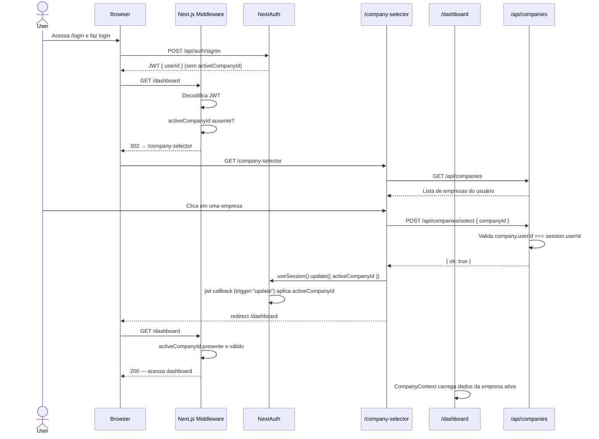
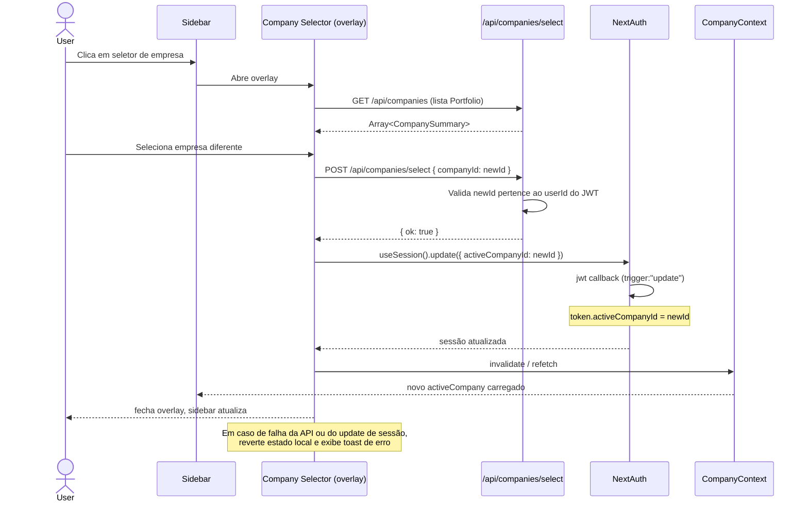
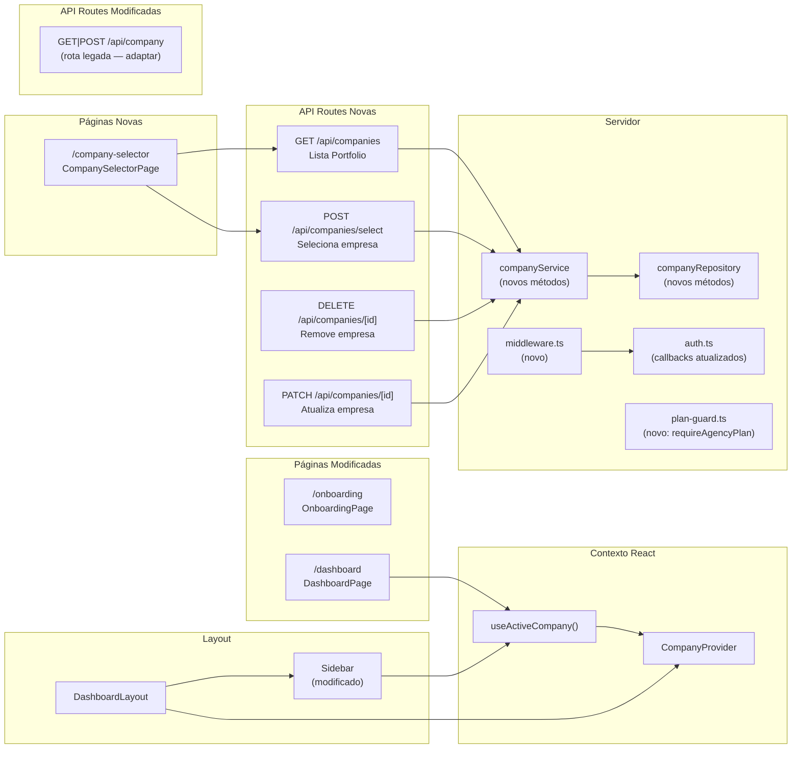
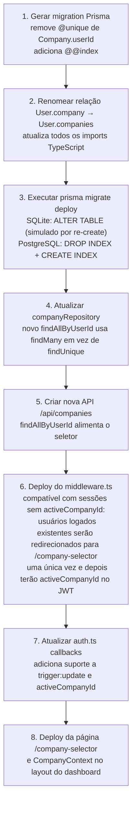

# Design Document: Multi-Company Management

## Índice

1. [Overview](#overview)
2. [Arquitetura de Alto Nível](#arquitetura-de-alto-nível)
3. [Fluxo de Autenticação e Seleção de Empresa](#fluxo-de-autenticação-e-seleção-de-empresa)
4. [Fluxo de Troca de Empresa](#fluxo-de-troca-de-empresa)
5. [Modelo de Dados Atualizado](#modelo-de-dados-atualizado)
6. [Mapa de Componentes](#mapa-de-componentes)
7. [Interfaces TypeScript](#interfaces-typescript)
8. [Assinaturas de Funções-Chave com Especificações Formais](#assinaturas-de-funções-chave-com-especificações-formais)
9. [Pseudocódigo: Middleware Next.js](#pseudocódigo-middleware-nextjs)
10. [Pseudocódigo: Callbacks JWT (NextAuth)](#pseudocódigo-callbacks-jwt-nextauth)
11. [Pseudocódigo: API Route de Seleção de Empresa](#pseudocódigo-api-route-de-seleção-de-empresa)
12. [Plano de Migração](#plano-de-migração)
13. [Estratégia de Testes e Property-Based Testing](#estratégia-de-testes-e-property-based-testing)
14. [Tratamento de Erros](#tratamento-de-erros)
15. [Considerações de Segurança](#considerações-de-segurança)
16. [Dependências](#dependências)

---

## Overview

A feature **Multi-Company Management** transforma a plataforma de marketing digital de uma arquitetura **1 usuário → 1 empresa** para **1 usuário → N empresas (carteira de clientes)**, atendendo usuários do plano Agência.

O núcleo da mudança é tríplice:

1. **Schema**: remover a restrição `@unique` em `Company.userId`, tornando a relação verdadeiramente 1:N.
2. **Sessão JWT**: adicionar `activeCompanyId` ao token, propagado pelo callback `jwt` do NextAuth — inclusive no fluxo `trigger: "update"` usado para troca de empresa em tempo real.
3. **Roteamento e contexto**: introduzir a página `/company-selector`, um middleware Next.js que protege o dashboard, e um `CompanyContext` React que fornece os dados da empresa ativa a todos os componentes.

Toda a segurança de isolamento de dados é resolvida no servidor: API routes lêem `activeCompanyId` exclusivamente do JWT e validam que a empresa pertence ao usuário autenticado antes de qualquer leitura ou escrita.

---

## Arquitetura de Alto Nível

```mermaid
graph TD
    subgraph "Cliente (Browser)"
        A[Página de Login] --> B{Autenticado?}
        B -->|Sim| C{activeCompanyId no JWT?}
        C -->|Não| D[/company-selector/]
        C -->|Sim| E[/dashboard/]
        D -->|Seleciona empresa| F[POST /api/companies/select]
        F -->|useSession\nupdate| E
        E --> G[Sidebar com empresa ativa]
        G -->|Clica trocar| D
    end

    subgraph "Next.js Edge (Middleware)"
        H[middleware.ts] -->|verifica JWT| I{token válido?}
        I -->|Não| J[Redireciona /login]
        I -->|Sim| K{activeCompanyId presente?}
        K -->|Não| L[Redireciona /company-selector]
        K -->|Sim| M[Deixa passar]
    end

    subgraph "Servidor (API Routes)"
        N[/api/companies] --> O[companyService]
        P[/api/companies/select] --> O
        Q[/api/company - CRUD existente] --> R[Validar companyId do JWT]
        O --> S[companyRepository]
        S --> T[(Prisma / SQLite → PostgreSQL)]
    end

    subgraph "Estado React"
        U[CompanyContext Provider]
        U --> V[useActiveCompany hook]
        V --> G
        V --> W[Qualquer componente do dashboard]
    end

    E --> U
```

---

## Fluxo de Autenticação e Seleção de Empresa



---

## Fluxo de Troca de Empresa



---

## Modelo de Dados Atualizado

### Diagrama ER — Mudanças no Schema

```mermaid
erDiagram
    User {
        string id PK
        string email UK
        string name
        string password
        string image
        datetime emailVerified
        datetime createdAt
        datetime updatedAt
    }

    Company {
        string id PK
        string userId FK "NOT UNIQUE — relação 1:N"
        string name
        string description
        string sector
        string objective
        string tone
        string logoUrl
        string colors
        datetime createdAt
        datetime updatedAt
    }

    Subscription {
        string id PK
        string userId FK UK
        string planId FK
        string status
        datetime currentPeriodStart
        datetime currentPeriodEnd
    }

    Plan {
        string id PK
        string name
        float priceMonthlyUsd
        boolean isActive
    }

    User ||--o{ Company : "possui (1:N)"
    User ||--o| Subscription : "assina"
    Subscription }o--|| Plan : "pertence a"
    Company ||--o{ Post : "tem"
    Company ||--o{ SocialAccount : "tem"
    Company ||--o{ CostLog : "tem"
    Company ||--o{ AdCampaign : "tem"
    Company ||--o{ VideoJob : "tem"
```

### Diff do `schema.prisma`

**Antes:**
```prisma
model User {
  company  Company?   // relação 1:1
}

model Company {
  userId  String  @unique   // ← impede múltiplas empresas
}
```

**Depois:**
```prisma
model User {
  companies  Company[]   // relação 1:N
}

model Company {
  userId  String          // @unique REMOVIDO
  @@index([userId])       // índice explícito mantém performance
}
```

Nenhum outro modelo de dados muda: todos os relacionamentos filhos já usam `companyId`, não `userId`.

---

## Mapa de Componentes



---

## Interfaces TypeScript

```typescript
// ─────────────────────────────────────────────
// Extensões do JWT e Session (next-auth.d.ts)
// ─────────────────────────────────────────────

declare module "next-auth/jwt" {
  interface JWT {
    id: string;
    activeCompanyId?: string;
  }
}

declare module "next-auth" {
  interface Session {
    user: {
      id: string;
      name?: string | null;
      email?: string | null;
      image?: string | null;
      activeCompanyId?: string;
    };
  }
}

// ─────────────────────────────────────────────
// DTOs de Company
// ─────────────────────────────────────────────

/** Representação resumida usada na listagem do seletor */
interface CompanySummary {
  id: string;
  name: string;
  sector: string | null;
  logoUrl: string | null;
}

/** Representação completa com redes sociais */
interface CompanyFull extends CompanySummary {
  description: string | null;
  objective: string | null;
  tone: string;
  colors: string[];
  socialAccounts: SocialAccountSummary[];
  createdAt: string; // ISO-8601
}

interface SocialAccountSummary {
  platform: string;
  connected: boolean;
  profileName: string | null;
}

/** Input de criação/atualização de empresa */
interface CompanyInput {
  name: string;           // 2–200 chars
  description?: string;
  sector?: string;
  objective?: string;
  tone?: string;
  colors?: string[];
}

/** Resposta do endpoint de seleção */
interface SelectCompanyResponse {
  ok: true;
  activeCompanyId: string;
}

// ─────────────────────────────────────────────
// CompanyContext
// ─────────────────────────────────────────────

interface CompanyContextValue {
  /** Dados completos da empresa ativa (null durante carregamento inicial) */
  company: CompanyFull | null;
  /** true enquanto o primeiro carregamento está em andamento */
  isLoading: boolean;
  /** Mensagem de erro se o carregamento falhou */
  error: string | null;
  /** Invalida o cache e recarrega os dados da empresa ativa */
  refresh: () => Promise<void>;
}

// ─────────────────────────────────────────────
// Payload do endpoint de seleção
// ─────────────────────────────────────────────

interface SelectCompanyBody {
  companyId: string;
}

// ─────────────────────────────────────────────
// Resultado de validação de guarda de plano
// ─────────────────────────────────────────────

interface PlanLimitResult {
  allowed: boolean;
  currentCount: number;
  maxAllowed: number;      // 1 para planos < Agência, 20 para Agência
  planName: string;
}
```

---

## Assinaturas de Funções-Chave com Especificações Formais

### `companyRepository` — novos métodos

```typescript
/**
 * Lista todas as empresas de um usuário, ordenadas por nome.
 *
 * Pré-condições:
 *   - userId é string não-vazia e corresponde a um User existente
 *
 * Pós-condições:
 *   - Retorna array (possivelmente vazio) de Companies onde ∀ c: c.userId === userId
 *   - A ordem é alfabética crescente por c.name (case-insensitive)
 *   - Nenhuma empresa de outro usuário é incluída no resultado
 */
findAllByUserId(userId: string): Promise<CompanySummary[]>;

/**
 * Busca uma empresa pelo seu ID primário.
 *
 * Pré-condições:
 *   - companyId é string não-vazia
 *
 * Pós-condições:
 *   - Retorna Company se existir, null caso contrário
 *   - Não lança exceção para IDs inexistentes
 */
findById(companyId: string): Promise<Company | null>;

/**
 * Cria uma nova empresa para o usuário.
 *
 * Pré-condições:
 *   - userId existe na tabela User
 *   - data.name satisfaz 2 ≤ data.name.trim().length ≤ 200
 *
 * Pós-condições:
 *   - Retorna Company criada com id gerado (cuid)
 *   - company.userId === userId
 *   - Não altera nenhuma Company existente
 */
create(userId: string, data: Omit<CompanyInput, "colors"> & { colors: string | null }): Promise<Company>;

/**
 * Atualiza dados de uma empresa pelo ID.
 *
 * Pré-condições:
 *   - companyId existe na tabela Company
 *   - Campos fornecidos passam nas regras de validação
 *
 * Pós-condições:
 *   - Retorna Company atualizada
 *   - company.id === companyId (imutável)
 *   - company.userId não é alterado
 */
update(companyId: string, data: Partial<CompanyInput & { colors: string | null; logoUrl: string | null }>): Promise<Company>;

/**
 * Exclui uma empresa e todos os registros em cascata (atomicamente).
 *
 * Pré-condições:
 *   - companyId existe na tabela Company
 *
 * Pós-condições:
 *   - Company e todos os registros filhos são removidos atomicamente
 *   - Se qualquer operação da transação falhar, nenhuma alteração é persistida
 *   - Retorna void em caso de sucesso
 */
deleteById(companyId: string): Promise<void>;

/**
 * Conta quantas empresas um usuário possui.
 *
 * Pré-condições:
 *   - userId é string não-vazia
 *
 * Pós-condições:
 *   - Retorna inteiro ≥ 0
 *   - O valor é consistente com findAllByUserId(userId).length
 */
countByUserId(userId: string): Promise<number>;
```

### `companyService` — novos métodos

```typescript
/**
 * Retorna todas as empresas do usuário para exibição no seletor.
 *
 * Pré-condições:
 *   - userId corresponde a User autenticado
 *
 * Pós-condições:
 *   - Retorna array ordenado alfabeticamente
 *   - ∀ c ∈ result: c.userId === userId (garantido pelo repository)
 */
listByUserId(userId: string): Promise<CompanySummary[]>;

/**
 * Cria uma nova empresa após validações de plano e nome.
 *
 * Pré-condições:
 *   - userId possui assinatura ativa
 *   - input.name satisfaz 2 ≤ trim(name).length ≤ 200
 *
 * Pós-condições:
 *   - Lança ValidationError se nome inválido
 *   - Lança ForbiddenError se plano não permite mais empresas
 *   - Retorna Company criada com id único
 *   - countByUserId(userId) aumenta em exatamente 1
 *
 * Invariante de loop (verificação de limite):
 *   - currentCount = countByUserId(userId) é lido uma única vez, atomicamente,
 *     antes da criação; condição: currentCount < maxAllowed
 */
createCompany(userId: string, input: CompanyInput): Promise<Company>;

/**
 * Valida e atualiza dados de uma empresa existente.
 *
 * Pré-condições:
 *   - companyId existe e company.userId === userId (verificado antes de chamar)
 *   - Ao menos um campo é fornecido no input
 *
 * Pós-condições:
 *   - Lança ValidationError se nome inválido
 *   - Retorna Company com campos atualizados
 *   - Campos não fornecidos mantêm valores anteriores
 */
updateCompany(userId: string, companyId: string, input: Partial<CompanyInput>): Promise<Company>;

/**
 * Remove uma empresa após verificar ownership.
 *
 * Pré-condições:
 *   - companyId existe
 *   - company.userId === userId
 *
 * Pós-condições:
 *   - Company e todos os filhos são excluídos atomicamente
 *   - Lança NotFoundError se companyId não existir
 *   - Lança ForbiddenError se company.userId !== userId
 */
deleteCompany(userId: string, companyId: string): Promise<void>;

/**
 * Verifica que o companyId pertence ao userId antes de qualquer operação.
 * Método utilitário chamado por todas as API routes que operam sobre dados de empresa.
 *
 * Pré-condições:
 *   - userId e companyId são strings não-vazias
 *
 * Pós-condições:
 *   - Retorna Company se ownership válido
 *   - Lança ForbiddenError (HTTP 403) se company.userId !== userId
 *   - Lança ForbiddenError (HTTP 403) se companyId não existir
 *     (resposta opaca — não revela existência do recurso)
 */
assertOwnership(userId: string, companyId: string): Promise<Company>;
```

### `plan-guard.ts` — nova função

```typescript
/**
 * Verifica o limite de empresas com base no plano do usuário.
 *
 * Pré-condições:
 *   - userId possui assinatura na tabela Subscription
 *
 * Pós-condições:
 *   - Plano Agência: maxAllowed = 20
 *   - Planos inferiores: maxAllowed = 1
 *   - Lança ForbiddenError se currentCount >= maxAllowed
 *   - Não lança erro se currentCount < maxAllowed
 */
async function assertCompanyLimit(userId: string): Promise<void>;

/**
 * Verifica se o usuário tem plano Agência ativo.
 *
 * Pós-condições:
 *   - Retorna true somente se status ∈ { "active", "trialing" }
 *     e plan.name === "Agencia"
 */
async function isAgencyPlan(userId: string): Promise<boolean>;
```

---

## Pseudocódigo: Middleware Next.js

```pascal
// src/middleware.ts

PROCEDURE middleware(request: NextRequest): NextResponse
  INPUT: request — requisição HTTP de qualquer rota
  OUTPUT: NextResponse (pass-through, redirect, ou 401)

  SEQUENCE
    // 1. Identificar se a rota precisa de proteção
    pathname ← request.nextUrl.pathname

    IF pathname starts with "/api/auth" THEN
      RETURN NextResponse.next()   // rotas do NextAuth passam sempre
    END IF

    IF pathname starts with "/_next" OR pathname is static asset THEN
      RETURN NextResponse.next()
    END IF

    isPublicRoute ← pathname IN ["/login", "/register", "/company-selector"]
    isDashboardRoute ← pathname starts with "/dashboard" OR
                       (pathname NOT IN publicRoutes AND NOT starts with "/api")
    isApiRoute ← pathname starts with "/api"

    // 2. Decodificar o token JWT
    token ← await getToken({ req: request, secret: process.env.NEXTAUTH_SECRET })

    // 3. Rota pública com usuário autenticado → redireciona para seletor ou dashboard
    IF isPublicRoute THEN
      IF token IS NOT NULL THEN
        IF token.activeCompanyId IS NOT NULL AND pathname = "/login" THEN
          RETURN redirect("/dashboard")
        END IF
        IF token.activeCompanyId IS NULL AND pathname = "/login" THEN
          RETURN redirect("/company-selector")
        END IF
      END IF
      RETURN NextResponse.next()
    END IF

    // 4. Sem token → não autenticado
    IF token IS NULL THEN
      IF isApiRoute THEN
        RETURN NextResponse.json({ error: "Unauthorized" }, 401)
      ELSE
        RETURN redirect("/login")
      END IF
    END IF

    // 5. Rota de dashboard ou API protegida sem activeCompanyId
    IF isDashboardRoute OR (isApiRoute AND NOT starts with "/api/companies/select") THEN
      IF token.activeCompanyId IS NULL OR token.activeCompanyId = "" THEN
        IF isApiRoute THEN
          RETURN NextResponse.json({ error: "No active company selected" }, 401)
        ELSE
          RETURN redirect("/company-selector")
        END IF
      END IF
    END IF

    // 6. Passa a requisição com header adicional para facilitar parsing no servidor
    requestHeaders ← new Headers(request.headers)
    requestHeaders.set("x-user-id", token.id)
    requestHeaders.set("x-active-company-id", token.activeCompanyId ?? "")

    RETURN NextResponse.next({ request: { headers: requestHeaders } })
  END SEQUENCE
END PROCEDURE

// Configuração do matcher
export const config = {
  matcher: ["/((?!_next/static|_next/image|favicon.ico).*)"]
}
```

---

## Pseudocódigo: Callbacks JWT (NextAuth)

```pascal
// src/server/lib/auth.ts — callbacks atualizados

PROCEDURE jwtCallback(params)
  INPUT:
    token   — JWT atual
    user    — dados do usuário (presente apenas no primeiro login)
    trigger — "signIn" | "update" | undefined
    session — novo payload enviado pelo cliente via useSession().update()
  OUTPUT: JWT atualizado

  SEQUENCE
    // Primeiro login: popula userId
    IF user IS NOT NULL THEN
      token.id ← user.id
      token.activeCompanyId ← undefined   // força passagem pelo seletor
    END IF

    // Atualização explícita via useSession().update({ activeCompanyId })
    IF trigger = "update" AND session IS NOT NULL THEN
      IF session.activeCompanyId IS NOT NULL THEN
        // Validação de segurança: confirma ownership no banco antes de aceitar
        company ← await prisma.company.findFirst({
          where: { id: session.activeCompanyId, userId: token.id }
        })
        IF company IS NOT NULL THEN
          token.activeCompanyId ← session.activeCompanyId
        ELSE
          // Tentativa de injetar companyId inválido — ignora silenciosamente
          // e mantém activeCompanyId anterior (pode ser undefined)
          NOOP
        END IF
      ELSE IF session.activeCompanyId = null THEN
        // Logout de empresa explícito (ex.: empresa deletada)
        token.activeCompanyId ← undefined
      END IF
    END IF

    RETURN token
  END SEQUENCE
END PROCEDURE

PROCEDURE sessionCallback(params)
  INPUT:
    session — objeto de sessão a ser retornado ao cliente
    token   — JWT decodificado
  OUTPUT: Session enriquecida

  SEQUENCE
    IF session.user IS NOT NULL THEN
      session.user.id              ← token.id
      session.user.activeCompanyId ← token.activeCompanyId ?? undefined
    END IF

    RETURN session
  END SEQUENCE
END PROCEDURE
```

**Invariante de segurança do jwt callback:**
> Para qualquer `trigger: "update"`, `token.activeCompanyId` somente é atualizado se `prisma.company.findFirst({ where: { id: newId, userId: token.id } })` retorna um registro não-nulo. Isso garante que um usuário não pode injetar o `companyId` de outro usuário via chamada direta ao endpoint do NextAuth.

---

## Pseudocódigo: API Route de Seleção de Empresa

```pascal
// src/app/api/companies/select/route.ts

PROCEDURE POST_selectCompany(request: Request): NextResponse
  INPUT: request com body { companyId: string }
  OUTPUT: { ok: true, activeCompanyId: string } ou erro

  SEQUENCE
    session ← await getServerSession(authOptions)
    IF session IS NULL OR session.user IS NULL THEN
      THROW UnauthorizedError()
    END IF

    userId    ← session.user.id
    body      ← await request.json()
    companyId ← body.companyId

    IF companyId IS NULL OR companyId = "" THEN
      THROW ValidationError("companyId é obrigatório")
    END IF

    // Valida ownership — lança ForbiddenError se não pertencer ao usuário
    company ← await companyService.assertOwnership(userId, companyId)

    // Responde com sucesso; o cliente usará useSession().update() para
    // propagar o activeCompanyId no JWT via jwtCallback trigger:"update"
    RETURN NextResponse.json({ ok: true, activeCompanyId: company.id })
  END SEQUENCE
END PROCEDURE
```

```pascal
// src/app/api/companies/route.ts

PROCEDURE GET_listCompanies(request: Request): NextResponse
  INPUT: —
  OUTPUT: Array<CompanySummary>

  SEQUENCE
    session ← await getServerSession(authOptions)
    IF session IS NULL THEN THROW UnauthorizedError() END IF

    companies ← await companyService.listByUserId(session.user.id)
    RETURN NextResponse.json(companies)
  END SEQUENCE
END PROCEDURE

PROCEDURE POST_createCompany(request: Request): NextResponse
  INPUT: body CompanyInput
  OUTPUT: Company criada

  SEQUENCE
    session ← await getServerSession(authOptions)
    IF session IS NULL THEN THROW UnauthorizedError() END IF

    body    ← await request.json()
    company ← await companyService.createCompany(session.user.id, body)
    RETURN NextResponse.json(company, { status: 201 })
  END SEQUENCE
END PROCEDURE
```

```pascal
// src/app/api/companies/[id]/route.ts

PROCEDURE PATCH_updateCompany(request: Request, { params }): NextResponse
  SEQUENCE
    session   ← await getServerSession(authOptions)
    IF session IS NULL THEN THROW UnauthorizedError() END IF

    // assertOwnership lança ForbiddenError (opaco) se inválido
    await companyService.assertOwnership(session.user.id, params.id)

    body    ← await request.json()
    updated ← await companyService.updateCompany(session.user.id, params.id, body)
    RETURN NextResponse.json(updated)
  END SEQUENCE
END PROCEDURE

PROCEDURE DELETE_removeCompany(request: Request, { params }): NextResponse
  SEQUENCE
    session ← await getServerSession(authOptions)
    IF session IS NULL THEN THROW UnauthorizedError() END IF

    await companyService.assertOwnership(session.user.id, params.id)
    await companyService.deleteCompany(session.user.id, params.id)
    RETURN NextResponse.json({ ok: true })
  END SEQUENCE
END PROCEDURE
```

---

## Plano de Migração

### Princípio

A migração é **aditiva e não-destrutiva**. Os dados existentes são 100% preservados. O único risco de perda de dados é a remoção da constraint `@unique`, que é uma operação DDL segura — não remove linhas, apenas relaxa a restrição.

### Passos da Migração



### Compatibilidade com Dados Existentes

| Situação | Comportamento após migração |
|---|---|
| Usuário com 1 empresa existente (plano básico/pro) | Login → `company-selector` exibe 1 empresa → seleciona → dashboard. Transparente para o usuário. |
| Usuário sem empresa (novo) | Login → `company-selector` com "Criar primeira empresa" → onboarding. |
| Usuário Agência com 1 empresa existente | Igual ao básico/pro, mas pode criar mais empresas pelo seletor. |
| Dados filhos (posts, campanhas, etc.) | Nenhuma alteração — todos já referenciavam `companyId`, não `userId`. |

### SQL da Migration (SQLite)

```sql
-- Migration: remove_company_userid_unique
-- Prisma gerará automaticamente para SQLite via re-create da tabela.
-- Para PostgreSQL, equivale a:

-- DROP INDEX IF EXISTS "Company_userId_key";
-- CREATE INDEX "Company_userId_idx" ON "Company"("userId");
```

---

## Estratégia de Testes e Property-Based Testing

### Visão Geral

| Camada | Framework | Foco |
|---|---|---|
| Unit | Jest | Funções puras: validação de nome, regras de plano, assertOwnership |
| Property-Based | Jest + fast-check | Invariantes do sistema sob entradas arbitrárias |
| Integration | Jest + Prisma (test DB) | Repository e Service com banco real |
| E2E (manual/futuro) | Playwright | Fluxos críticos: login → seletor → dashboard → troca |

### Propriedades para Property-Based Testing (fast-check)

#### P1 — Isolamento de dados: nenhum vazamento entre usuários

```typescript
// Propriedade: para qualquer par (userId_A, userId_B) distintos,
// findAllByUserId(userId_A) ∩ findAllByUserId(userId_B) = ∅
//
// Invariante formal:
//   ∀ userA ≠ userB,
//   ∀ c ∈ findAllByUserId(userA):
//     c ∉ findAllByUserId(userB)

it("P1: companies nunca vazam entre usuários distintos", () =>
  fc.assert(
    fc.asyncProperty(
      fc.record({ userId: fc.string({ minLength: 1 }) }),
      fc.record({ userId: fc.string({ minLength: 1 }) }),
      fc.array(fc.record({ name: fc.string({ minLength: 2, maxLength: 200 }) }), { minLength: 1 }),
      async (userA, userB, companiesA) => {
        fc.pre(userA.userId !== userB.userId);
        // Setup: cria empresas só para userA
        // Verifica: findAllByUserId(userB) retorna array vazio
        const resultB = await companyRepository.findAllByUserId(userB.userId);
        return resultB.every(c => c.userId !== userA.userId);
      }
    )
  )
);
```

#### P2 — Limite de plano é sempre respeitado

```typescript
// Propriedade: createCompany nunca persiste a N+1-ésima empresa
// quando N já atingiu o limite do plano
//
// Invariante formal:
//   ∀ userId, ∀ plan:
//     let max = plan === "Agencia" ? 20 : 1
//     let count = countByUserId(userId)
//     count >= max ⟹ createCompany(userId, input) throws ForbiddenError

it("P2: limite de plano é sempre respeitado", () =>
  fc.assert(
    fc.asyncProperty(
      fc.integer({ min: 1, max: 25 }),
      fc.constantFrom("Basico", "Profissional", "Agencia"),
      async (attemptCount, planName) => {
        const max = planName === "Agencia" ? 20 : 1;
        // Cria exatamente max empresas
        // Tenta criar mais uma → deve lançar ForbiddenError
        await expect(
          companyService.createCompany(userId, { name: "Extra" })
        ).rejects.toBeInstanceOf(ForbiddenError);
        // Contagem não aumentou
        expect(await companyRepository.countByUserId(userId)).toBe(max);
      }
    )
  )
);
```

#### P3 — assertOwnership é opaco: nunca diferencia "não existe" de "não pertence"

```typescript
// Propriedade: assertOwnership(userId, anyId) onde anyId não pertence a userId
// SEMPRE lança ForbiddenError — nunca NotFoundError, nunca resolve
//
// Invariante formal:
//   ∀ userId, ∀ companyId:
//     (company.userId ≠ userId ∨ company não existe) ⟹
//       assertOwnership(userId, companyId) throws ForbiddenError

it("P3: assertOwnership é opaco para IDs inválidos e de outros usuários", () =>
  fc.assert(
    fc.asyncProperty(
      fc.string({ minLength: 1 }),
      fc.string({ minLength: 1 }),
      async (userId, companyId) => {
        // companyId inexistente ou de outro usuário
        await expect(
          companyService.assertOwnership(userId, companyId)
        ).rejects.toBeInstanceOf(ForbiddenError);
      }
    )
  )
);
```

#### P4 — Validação de nome é consistente

```typescript
// Propriedade: createCompany lança ValidationError para qualquer nome
// que não satisfaça 2 ≤ trim(name).length ≤ 200
//
// Invariante formal:
//   ∀ name: trim(name).length < 2 ∨ trim(name).length > 200 ⟹
//     createCompany(userId, { name }) throws ValidationError

it("P4: nomes inválidos sempre lançam ValidationError", () =>
  fc.assert(
    fc.asyncProperty(
      fc.oneof(
        fc.string({ maxLength: 1 }),                        // muito curto
        fc.string({ minLength: 201, maxLength: 300 }),      // muito longo
        fc.constant(""),                                    // vazio
        fc.constant("   "),                                 // só espaços
      ),
      async (name) => {
        await expect(
          companyService.createCompany(validUserId, { name })
        ).rejects.toBeInstanceOf(ValidationError);
      }
    )
  )
);
```

#### P5 — Exclusão cascata é atômica

```typescript
// Propriedade: após deleteCompany(userId, companyId) com sucesso,
// NENHUM registro filho sobrevive no banco
//
// Invariante formal:
//   ∀ company: após deleteById(company.id):
//     count(Post where companyId = company.id) = 0
//     ∧ count(SocialAccount where companyId = company.id) = 0
//     ∧ count(CostLog where companyId = company.id) = 0
//     ∧ (∀ outro modelo filho: count = 0)

it("P5: deleteCompany elimina todos os registros filhos", () =>
  fc.assert(
    fc.asyncProperty(
      fc.integer({ min: 0, max: 5 }),  // nº de posts a criar
      fc.integer({ min: 0, max: 3 }),  // nº de social accounts
      async (postCount, socialCount) => {
        // Setup: cria empresa com filhos
        // Executa: deleteCompany
        // Verifica: todos os filhos foram removidos
        const posts = await prisma.post.count({ where: { companyId } });
        const socials = await prisma.socialAccount.count({ where: { companyId } });
        return posts === 0 && socials === 0;
      }
    )
  )
);
```

#### P6 — JWT callback nunca aceita activeCompanyId de outro usuário

```typescript
// Propriedade: o jwtCallback com trigger:"update" nunca persiste
// um activeCompanyId que não pertença ao token.id
//
// Invariante formal:
//   ∀ token.id, ∀ session.activeCompanyId:
//     company.userId ≠ token.id ⟹
//       result.activeCompanyId = token.activeCompanyId (inalterado)

it("P6: jwt callback rejeita activeCompanyId de outro usuário", () =>
  fc.assert(
    fc.asyncProperty(
      fc.string({ minLength: 1 }),  // userId legítimo
      fc.string({ minLength: 1 }),  // companyId de outro usuário
      async (userId, foreignCompanyId) => {
        fc.pre(userId !== foreignCompanyId);
        const token = { id: userId, activeCompanyId: undefined };
        const result = await jwtCallback({
          token,
          trigger: "update",
          session: { activeCompanyId: foreignCompanyId },
        });
        // Deve manter o activeCompanyId anterior (undefined), nunca aceitar o estrangeiro
        return result.activeCompanyId === undefined;
      }
    )
  )
);
```

### Casos de Teste de Unidade (exemplos diretos)

```typescript
// Validação de nome de empresa
describe("companyService.createCompany — validação de nome", () => {
  it("aceita nomes de 2 a 200 caracteres", ...)
  it("rejeita string vazia", ...)
  it("rejeita string só de espaços", ...)
  it("rejeita nomes com 201+ caracteres", ...)
  it("aplica trim antes de validar", ...)
});

// Seleção de empresa
describe("POST /api/companies/select", () => {
  it("retorna 200 para empresa válida do usuário", ...)
  it("retorna 403 para empresa de outro usuário", ...)
  it("retorna 403 para companyId inexistente (resposta opaca)", ...)
  it("retorna 401 sem sessão ativa", ...)
  it("retorna 422 sem companyId no body", ...)
});

// Middleware
describe("middleware.ts", () => {
  it("deixa /api/auth/* passar sem verificação", ...)
  it("redireciona /dashboard para /login quando sem token", ...)
  it("redireciona /dashboard para /company-selector quando sem activeCompanyId", ...)
  it("passa /dashboard quando JWT tem userId e activeCompanyId", ...)
  it("retorna 401 JSON para /api/* sem token", ...)
  it("retorna 401 JSON para /api/* sem activeCompanyId", ...)
  it("passa /company-selector sem activeCompanyId", ...)
});

// Limite de plano
describe("assertCompanyLimit", () => {
  it("permite criação para plano Agência com < 20 empresas", ...)
  it("bloqueia criação para plano Agência com exatamente 20 empresas", ...)
  it("permite criação para plano básico com 0 empresas", ...)
  it("bloqueia criação para plano básico com 1 empresa", ...)
});
```

---

## Tratamento de Erros

| Cenário | Código HTTP | Comportamento no Cliente |
|---|---|---|
| Sem sessão JWT | 401 | Middleware redireciona para `/login` |
| `activeCompanyId` ausente no JWT | 401 (API) / redirect (página) | Redirecionado para `/company-selector` |
| `companyId` não pertence ao usuário | 403 | Toast de erro; página não navega |
| Empresa não encontrada (resposta opaca) | 403 | Mesmo tratamento de "não pertence" |
| Nome inválido no formulário | 422 | Mensagem inline no campo de nome |
| Limite de plano atingido | 403 | Modal explicativo com link para upgrade |
| Falha técnica no banco | 500 | Toast genérico com "tente novamente" |
| Falha na troca de empresa (useSession.update) | — | Reverte `activeCompanyId` local; toast de erro |
| Portfolio vazio ao abrir seletor | 200 + array vazio | Exibe somente botão "Criar primeira empresa" |
| Falha ao carregar Portfolio | 500 | Mensagem de erro + botão "Tentar novamente" |

---

## Considerações de Segurança

### IDOR (Insecure Direct Object Reference)

Todos os endpoints que recebem `companyId` (seja em params, query ou body) **sempre** chamam `companyService.assertOwnership(userId, companyId)` antes de qualquer leitura ou escrita. O método retorna `ForbiddenError` de forma opaca — não diferencia "não existe" de "não pertence ao usuário" — impedindo enumeração de IDs.

### Injeção de `activeCompanyId` via JWT Update

O `jwtCallback` com `trigger: "update"` valida o novo `activeCompanyId` diretamente no banco (`prisma.company.findFirst({ where: { id, userId } })`) antes de aceitá-lo. Um atacante que chame `useSession().update({ activeCompanyId: "id-de-outro-usuario" })` terá o token mantido inalterado.

### Sem `companyId` no Body como Fonte de Autorização

Nenhuma API route aceita `companyId` do body/query como fonte de autorização. O `activeCompanyId` é sempre lido do JWT (`getServerSession`). O body pode conter dados de conteúdo, mas o escopo de segurança é sempre determinado pelo JWT.

### Headers de Conveniência do Middleware

O middleware injeta `x-user-id` e `x-active-company-id` como headers para facilitar leitura nas API routes, mas esses headers **nunca são a fonte de verdade**. As API routes ainda chamam `getServerSession` para obter o token real — os headers são apenas atalho para logging e debugging.

---

## Dependências

Nenhuma nova dependência de produção é necessária. Todas as tecnologias utilizadas já estão presentes:

| Dependência | Versão atual | Uso nesta feature |
|---|---|---|
| `next-auth` | ^4.24.14 | `trigger: "update"` no jwt callback; `useSession().update()` no cliente |
| `@auth/prisma-adapter` | ^2.11.2 | Sem alteração |
| `prisma` / `@prisma/client` | ^6.19.3 | Nova migration (remove `@unique`), novos métodos de repository |
| `next` | 16.2.6 | `middleware.ts` na raiz de `src/` |
| `fast-check` | (ausente — adicionar em devDependencies) | Property-based testing |
| `jest` | ^29.7.0 | Testes unitários e de integração |

> **Nota sobre `fast-check`**: O `package.json` atual referencia Jest mas não inclui `fast-check`. É necessário adicionar `"fast-check": "^3.21.0"` em `devDependencies` (`npm install --save-dev fast-check@3.21.0`).
