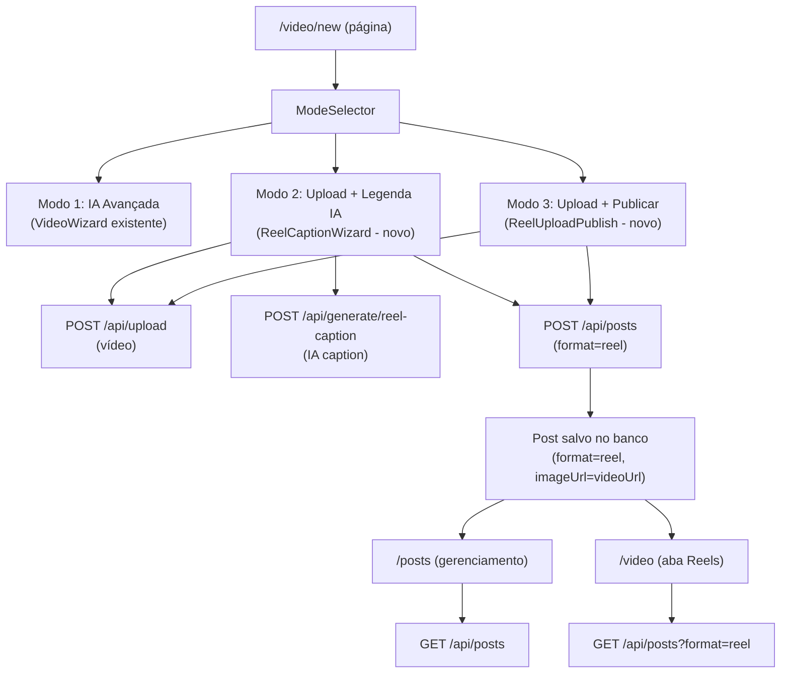
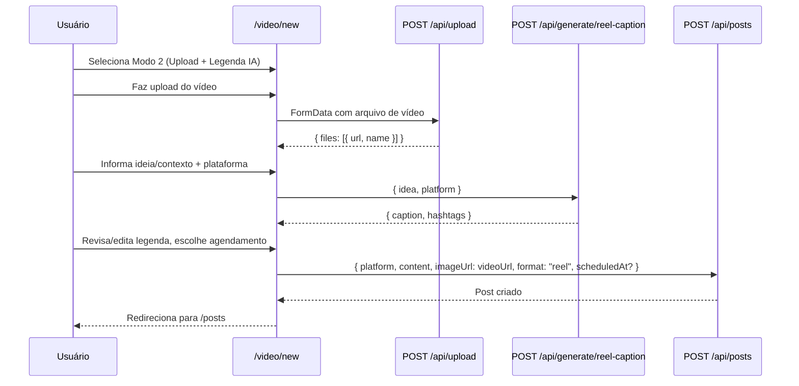
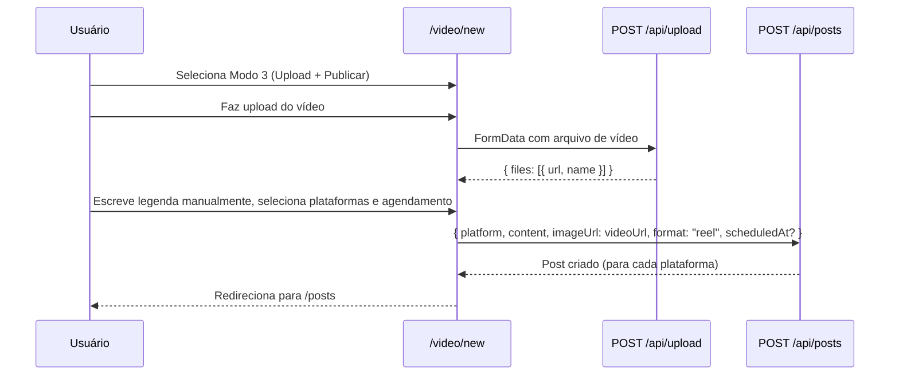

# Design Document: Reel Caption & Upload

## Overview

Esta feature adiciona duas novas capacidades à seção de vídeo da plataforma: (1) geração de legenda, hashtags e CTA para reels via IA a partir de um vídeo já pronto, e (2) upload de vídeo pronto com agendamento e publicação direta nas redes sociais. Ambas as capacidades se integram ao modelo `Post` existente com `format="reel"`, reutilizando os componentes `PlatformSelector` e `ScheduleAndSave` do create-post e todas as APIs já disponíveis.

A nova página `/video/new` passa a oferecer três modos de criação num único wizard: o pipeline de IA avançada existente (`VideoWizard`), o novo modo "Upload + Legenda IA" e o novo modo "Upload + Publicar". A página `/video` ganha uma segunda aba que lista os `Post` com `format="reel"`. A página `/posts` já suporta reels sem mudanças, pois os posts são salvos pelo modelo `Post`.

---

## Arquitetura







---

## Componentes e Interfaces

### 1. ModeSelector (novo — dentro de `/video/new`)

**Propósito**: Substituir a atual página `/video/new` por um seletor de três modos, mantendo o `VideoWizard` e adicionando os dois novos.

**Interface**:
```typescript
type VideoCreationMode = "ai-pipeline" | "upload-caption" | "upload-publish"

interface ModeSelectorProps {
  activeMode: VideoCreationMode
  onSelect: (mode: VideoCreationMode) => void
}
```

**Responsabilidades**:
- Exibir três cards de seleção com descrições claras
- Modo 1 (IA Avançada): ícone de varinha mágica, fundo azul quando ativo
- Modo 2 (Upload + Legenda IA): ícone de faísca/sparkles, fundo roxo quando ativo
- Modo 3 (Upload + Publicar): ícone de send, fundo verde quando ativo
- Renderizar o componente correto para o modo selecionado

---

### 2. ReelCaptionWizard (novo — `src/client/components/video/ReelCaptionWizard.tsx`)

**Propósito**: Wizard em 3 etapas para upload de vídeo + geração de legenda por IA + salvar/agendar.

**Interface**:
```typescript
interface ReelCaptionWizardProps {
  onComplete?: () => void
}

// Estado interno (não exportado)
interface ReelCaptionState {
  // Etapa 1: Upload
  videoFile: { url: string; name: string } | null
  uploading: boolean
  uploadError: string

  // Etapa 2: Geração
  idea: string
  platforms: string[]             // plataformas de vídeo: instagram, tiktok, youtube
  caption: string
  hashtags: string[]
  loadingCaption: boolean
  captionError: string

  // Etapa 3: Salvar
  editedCaption: string           // versão editada pelo usuário
  scheduledAt: string
  saving: boolean
  saveError: string
}
```

**Responsabilidades**:
- Etapa 1: Dropzone de upload de vídeo (reutiliza padrão do create-post `uploadTextOnlyMedia`)
- Etapa 2: Campo de ideia/contexto + `VideoPlatformSelector` + botão "Gerar Legenda"
- Etapa 3: Textarea editável com legenda gerada + hashtags + `ScheduleAndSave` reutilizado
- Ao salvar: chama `POST /api/posts` com `{ platform, content, imageUrl: videoUrl, format: "reel", scheduledAt? }` para cada plataforma selecionada
- Redireciona para `/posts` após sucesso

---

### 3. ReelUploadPublish (novo — `src/client/components/video/ReelUploadPublish.tsx`)

**Propósito**: Upload direto de vídeo com texto manual, seleção de plataformas e agendamento/publicação.

**Interface**:
```typescript
interface ReelUploadPublishProps {
  onComplete?: () => void
}

interface ReelUploadPublishState {
  videoFile: { url: string; name: string } | null
  uploading: boolean
  uploadError: string
  caption: string
  platforms: string[]
  scheduledAt: string
  saving: boolean
  saveError: string
}
```

**Responsabilidades**:
- Dropzone de upload de vídeo
- Textarea para legenda manual
- `VideoPlatformSelector` para escolha de plataformas
- `ScheduleAndSave` reutilizado do create-post
- Ao salvar: chama `POST /api/posts` com `format: "reel"` para cada plataforma
- Redireciona para `/posts` após sucesso

---

### 4. VideoPlatformSelector (novo — `src/client/components/video/VideoPlatformSelector.tsx`)

**Propósito**: Seletor de plataformas focado em plataformas de vídeo, separado do `PlatformSelector` do create-post que inclui Facebook, LinkedIn e WhatsApp.

**Interface**:
```typescript
const VIDEO_PLATFORMS = [
  { id: "instagram", label: "Instagram Reels", emoji: "📸" },
  { id: "tiktok",    label: "TikTok",          emoji: "🎵" },
  { id: "youtube",   label: "YouTube Shorts",   emoji: "▶️" },
] as const

interface VideoPlatformSelectorProps {
  platforms: string[]
  setPlatforms: (platforms: string[]) => void
}
```

**Responsabilidades**:
- Exibir apenas Instagram Reels, TikTok e YouTube Shorts
- Mesma lógica de seleção múltipla do `PlatformSelector` existente
- Avisos contextuais para TikTok (requer app aprovado)
- Contagem de posts a serem criados quando múltiplos selecionados

---

### 5. ReelGallerySection (novo — `src/client/components/video/ReelGallerySection.tsx`)

**Propósito**: Seção na página `/video` listando posts com `format="reel"`, separada dos `VideoJob`s.

**Interface**:
```typescript
interface ReelPost {
  id: string
  platform: string
  content: string | null
  imageUrl: string | null   // URL do vídeo
  status: string            // draft | scheduled | published
  scheduledAt: string | null
  publishedAt: string | null
  createdAt: string
}

interface ReelGallerySectionProps {
  // sem props — busca dados internamente
}
```

**Responsabilidades**:
- Buscar `GET /api/posts?format=reel` (requer novo query param no endpoint)
- Exibir grid de cards com thumbnail de vídeo (se disponível), plataforma, status, data
- Ações inline: Publicar, Excluir
- Estado vazio amigável com CTA para `/video/new`
- Paginação básica

---

### 6. Extensão da Página `/video` (modificação em `src/app/(dashboard)/video/page.tsx`)

**Propósito**: Adicionar sistema de abas separando VideoJobs (pipeline IA) dos Reels agendados.

**Interface**:
```typescript
type VideoTab = "ai-jobs" | "reels"
```

**Responsabilidades**:
- Aba "Vídeos com IA" → `VideoGalleryGrid` atual
- Aba "Reels Agendados" → `ReelGallerySection` novo
- Contador de items em cada aba (badge)

---

### 7. Extensão da API `/api/posts` (modificação em `src/app/api/posts/route.ts`)

**Propósito**: Adicionar suporte ao filtro `format` no GET e passar `format` ao criar post.

**Mudanças no GET**:
```typescript
// Novo query param
const format = searchParams.get("format") ?? undefined
// Repassado para postService.listByCompanyId
```

**Mudanças no POST**:
```typescript
// Ler format do body e passar ao service
const format = typeof body["format"] === "string" ? body["format"] : undefined
```

**Mudanças no `postService.createForCompany`**:
```typescript
type PostInput = {
  // ... campos existentes ...
  format?: string  // "post" | "carousel" | "reel" | "story"
}
```

**Mudanças no `postRepository.create`**:
- Incluir `format` no `prisma.post.create` (já existe no schema, só precisa ser passado)

**Mudanças em `postService.listByCompanyId`**:
```typescript
async listByCompanyId(
  companyId: string,
  options: { page?: number; pageSize?: number; format?: string } = {},
)
// Adicionar where: { format: options.format } quando format for fornecido
```

**Mudanças em `postService.createForCompany`**:
- Remover validação rígida de `VALID_PLATFORMS` para aceitar `tiktok` e `youtube` (já que `tiktok` está no create-post mas não no service)

---

### 8. Extensão da API `/api/generate/reel-caption` (modificação)

**Propósito**: Suportar as plataformas TikTok e YouTube Shorts além do Instagram.

**Mudanças**:
```typescript
// Remover validação rígida de platform:
// Antes:
if (platform !== "instagram") { ... erro ... }

// Depois: aceitar instagram, tiktok, youtube
const VALID_VIDEO_PLATFORMS = ["instagram", "tiktok", "youtube"]
if (!VALID_VIDEO_PLATFORMS.includes(platform)) { ... erro ... }

// Ajustar system prompt dinamicamente por plataforma:
const platformLabel = {
  instagram: "Instagram Reels",
  tiktok: "TikTok",
  youtube: "YouTube Shorts",
}[platform] ?? platform
```

---

## Modelos de Dados

### Post (sem alteração no schema Prisma)

O campo `format` já existe no modelo `Post` como `String? @default("post")`. O campo `imageUrl` é reutilizado para armazenar a URL do vídeo (padrão já adotado no código de publicação social).

```typescript
interface ReelPostData {
  platform: string        // "instagram" | "tiktok" | "youtube"
  content: string         // legenda completa com hashtags
  imageUrl: string        // URL do vídeo no storage (public/uploads/...)
  format: "reel"          // discriminador
  scheduledAt?: string    // ISO string ou null
  status: "draft" | "scheduled" | "published"
}
```

**Regras de validação**:
- `platform` deve ser um dos valores suportados
- `content` é obrigatório para reels (legenda é a identidade do reel)
- `imageUrl` é obrigatório para reels (não faz sentido um reel sem vídeo)
- `scheduledAt` quando presente deve ser uma data futura

---

## Pseudocódigo Algorítmico

### Algoritmo Principal — Salvar Reel (compartilhado entre Modo 2 e Modo 3)

```pascal
PROCEDURE saveReelPost(videoUrl, caption, platforms, scheduledAt)
  INPUT: videoUrl (String), caption (String), platforms (String[]),
         scheduledAt (String | null)
  OUTPUT: posts (Post[])

  PRECONDITIONS:
    - videoUrl é não-nulo e começa com "/"
    - caption é não-vazio (trim)
    - platforms contém pelo menos 1 elemento
    - scheduledAt é null ou data ISO válida no futuro

  BEGIN
    posts ← []

    FOR each platform IN platforms DO
      ASSERT platform ∈ { "instagram", "tiktok", "youtube" }

      body ← {
        platform: platform,
        content:  caption,
        imageUrl: videoUrl,
        format:   "reel",
        scheduledAt: scheduledAt OR null
      }

      response ← AWAIT fetch("POST /api/posts", body)

      IF response.ok THEN
        posts.append(response.post)
      ELSE
        THROW Error(response.error)
      END IF
    END FOR

    ASSERT posts.length = platforms.length

    RETURN posts
  END

  POSTCONDITIONS:
    - Para cada plataforma, um Post com format="reel" foi criado no banco
    - Se scheduledAt fornecido → status="scheduled"
    - Se scheduledAt null → status="draft"
```

---

### Algoritmo — Gerar Legenda com IA (Modo 2)

```pascal
PROCEDURE generateReelCaption(idea, platform)
  INPUT: idea (String), platform (String)
  OUTPUT: { caption: String, hashtags: String[] }

  PRECONDITIONS:
    - platform ∈ { "instagram", "tiktok", "youtube" }
    - idea pode ser vazio (IA usa contexto da empresa)

  BEGIN
    body ← { idea: idea, platform: platform }
    response ← AWAIT fetch("POST /api/generate/reel-caption", body)

    IF NOT response.ok THEN
      THROW Error(response.error)
    END IF

    caption   ← response.caption   // String não-vazia
    hashtags  ← response.hashtags  // String[] com "#" prefixo

    ASSERT caption.length > 0
    ASSERT hashtags.length >= 1

    RETURN { caption, hashtags }
  END

  POSTCONDITIONS:
    - caption é uma legenda coerente com o contexto da empresa
    - hashtags são relevantes à plataforma e setor da empresa
```

---

### Algoritmo — Upload de Vídeo

```pascal
PROCEDURE uploadVideo(file)
  INPUT: file (File) — tipo video/mp4, video/mov, video/quicktime
  OUTPUT: { url: String, name: String }

  PRECONDITIONS:
    - file.type começa com "video/"
    - file.size ≤ limite configurado (ex: 100MB)

  BEGIN
    form ← new FormData()
    form.append("files", file)

    response ← AWAIT fetch("POST /api/upload", form)

    IF NOT response.ok THEN
      THROW Error(response.error)
    END IF

    ASSERT response.files.length >= 1

    RETURN response.files[0]  // { url, name }
  END

  POSTCONDITIONS:
    - url é um caminho relativo acessível publicamente
    - O arquivo está persistido no diretório public/uploads/
```

---

### Algoritmo — Montar Caption Final com Hashtags

```pascal
PROCEDURE buildFinalCaption(caption, hashtags)
  INPUT: caption (String), hashtags (String[])
  OUTPUT: fullCaption (String)

  PRECONDITIONS:
    - caption é String (pode ser editada pelo usuário)
    - hashtags é String[] (pode ser vazio)

  BEGIN
    IF hashtags.length > 0 THEN
      hashtagsLine ← hashtags.join(" ")
      fullCaption  ← caption + "\n\n" + hashtagsLine
    ELSE
      fullCaption ← caption
    END IF

    ASSERT fullCaption.length <= 2200  // limite Instagram

    RETURN fullCaption
  END
```

---

### Algoritmo — Carregar Reels na Aba `/video`

```pascal
PROCEDURE loadReels(page)
  INPUT: page (Int) — padrão 1
  OUTPUT: { reels: ReelPost[], pagination: Pagination }

  PRECONDITIONS:
    - Usuário autenticado com empresa ativa

  BEGIN
    response ← AWAIT fetch("GET /api/posts?format=reel&page={page}&pageSize=12")

    IF NOT response.ok THEN
      THROW Error("Falha ao carregar reels")
    END IF

    RETURN {
      reels:      response.data,
      pagination: response.pagination
    }
  END

  POSTCONDITIONS:
    - Apenas posts com format="reel" da empresa ativa são retornados
    - Resultado ordenado por createdAt DESC
```

---

## Especificações Formais das Funções-Chave

### `postService.createForCompany` (extensão)

```typescript
async createForCompany(companyId: string, input: PostInput): Promise<Post>
```

**Precondições**:
- `companyId` é um ID válido de empresa pertencente ao usuário autenticado
- `input.platform` ∈ `{ "instagram", "facebook", "linkedin", "whatsapp", "tiktok", "youtube" }`
- Quando `input.format === "reel"`: `input.imageUrl` é não-nulo (URL do vídeo)
- Quando `input.format === "reel"`: `input.content` é não-nulo (legenda)
- `input.scheduledAt` é null ou uma string ISO 8601 válida

**Pós-condições**:
- Um `Post` é criado no banco com `companyId`, `platform`, `format`
- Se `scheduledAt` fornecido → `post.status = "scheduled"` e `post.scheduledAt` = data fornecida
- Se `scheduledAt` nulo → `post.status = "draft"`
- O `post.id` retornado é único (cuid)

**Invariantes de loop** (buildVariants): Todos os variants processados até o índice atual têm `type ∈ {"text", "image"}` e `selected` correto.

---

### `postService.listByCompanyId` (extensão)

```typescript
async listByCompanyId(
  companyId: string,
  options: { page?: number; pageSize?: number; format?: string }
): Promise<{ data: Post[]; total: number; ... }>
```

**Precondições**:
- `companyId` é válido
- `options.page >= 1`
- `options.pageSize` ∈ `[1, 100]`
- `options.format` é null | `"post"` | `"carousel"` | `"reel"` | `"story"`

**Pós-condições**:
- `data` contém apenas posts da empresa `companyId`
- Se `format` fornecido: todos os posts em `data` têm `post.format === format`
- `total` reflete o total sem paginação aplicado o mesmo filtro de format
- `data.length <= options.pageSize`

---

## Estratégia de Tratamento de Erros

### Cenário 1: Falha no Upload do Vídeo

**Condição**: API `/api/upload` retorna erro ou rede falha  
**Resposta**: Exibir mensagem de erro inline na zona de upload, manter estado do wizard na Etapa 1  
**Recuperação**: Usuário pode tentar novamente sem recarregar a página

### Cenário 2: Falha na Geração de Legenda

**Condição**: API `/api/generate/reel-caption` retorna erro (quota, timeout, resposta IA malformada)  
**Resposta**: Exibir alerta vermelho com mensagem do erro, manter vídeo já uploaded  
**Recuperação**: Usuário pode retentar geração ou avançar para Etapa 3 sem legenda gerada (modo fallback: textarea vazia)

### Cenário 3: Falha ao Salvar Post

**Condição**: API `/api/posts` retorna erro para uma ou mais plataformas  
**Resposta**: Exibir mensagem específica por plataforma, listar quais falharam  
**Recuperação**: Usuário pode retentar; posts já criados com sucesso não são duplicados (sem retry automático)

### Cenário 4: Plataforma Não Conectada

**Condição**: Usuário seleciona TikTok/YouTube sem conta social conectada  
**Resposta**: Aviso informativo (não bloqueia) — o post é salvo como rascunho mesmo assim  
**Recuperação**: Usuário pode conectar a conta em `/settings/social` e publicar depois

### Cenário 5: Vídeo Muito Grande

**Condição**: Usuário tenta fazer upload de vídeo > limite (ex: 100MB)  
**Resposta**: Validação client-side antes do upload, mensagem clara com o limite  
**Recuperação**: Usuário comprime o vídeo e tenta novamente

---

## Estratégia de Testes

### Testes Unitários

**Componentes**:
- `ReelCaptionWizard`: renderiza as 3 etapas, botão "Gerar" desabilitado sem vídeo, botão "Salvar" desabilitado sem legenda
- `ReelUploadPublish`: campo de legenda manual, seleção de plataformas, submit condicional
- `VideoPlatformSelector`: seleção múltipla, mínimo de 1 plataforma selecionada
- `buildFinalCaption`: caption sem hashtags, caption com hashtags, limite de 2200 chars

**Serviços**:
- `postService.createForCompany` com `format="reel"`: aceita tiktok/youtube, rejeita platform inválida, persiste format correto
- `postService.listByCompanyId` com `format="reel"`: filtra corretamente por format, não retorna posts de outras empresas

### Testes de Propriedade (Property-Based)

**Biblioteca**: `fast-check` (já no ecosistema Next.js/TypeScript)

**Propriedade 1 — buildFinalCaption nunca excede 2200 chars**:
```
∀ caption: String, hashtags: String[]
  where caption.length ≤ 2200
  ⟹ buildFinalCaption(caption, hashtags).length ≤ 2200
```

**Propriedade 2 — saveReelPost cria N posts para N plataformas**:
```
∀ platforms: String[] where platforms.length ≥ 1
  e todos os posts salvos com sucesso
  ⟹ createdPosts.length = platforms.length
```

**Propriedade 3 — listByCompanyId com format filtra corretamente**:
```
∀ posts salvos com format="reel" e format="post" para mesma empresa
  ⟹ listByCompanyId(companyId, { format: "reel" }).data contém apenas posts com format="reel"
```

### Testes de Integração

- Fluxo completo Modo 2: upload → geração → salvar → aparece em `/posts`
- Fluxo completo Modo 3: upload → legenda manual → salvar agendado → aparece em `/video` aba Reels
- Publicação de reel via `/api/social/publish` (fluxo existente, não muda)

---

## Considerações de Performance

- O upload de vídeo usa o endpoint `/api/upload` existente, que grava em `public/uploads/`. Para vídeos grandes, a API Next.js tem limite de body size — pode ser necessário ajustar `next.config.ts` com `api.bodyParser.sizeLimit`.
- A listagem de reels em `/video` é uma segunda chamada à API; usar `Promise.all` para buscar VideoJobs e Posts em paralelo na página.
- O campo `imageUrl` no `Post` armazena a URL completa do vídeo; para a thumbnail no card, usar o primeiro frame extraído ou um placeholder de vídeo enquanto carrega.
- Paginação de 12 itens por página (consistente com `VideoGalleryGrid`).

---

## Considerações de Segurança

- A API `/api/posts` já valida `companyId` via `assertOwnership` — reels são automaticamente isolados por empresa.
- Upload de vídeo: validar MIME type server-side em `/api/upload` para aceitar apenas `video/*` além das imagens já suportadas.
- A URL do vídeo salva em `imageUrl` é um caminho relativo (`/uploads/...`) servido estaticamente — sem exposição de paths do sistema de arquivos.
- A geração de legenda via Bedrock já é autenticada e tem cost logging — sem mudanças necessárias.

---

## Dependências

**Internas (reutilizadas)**:
- `POST /api/upload` — upload de arquivos
- `POST /api/generate/reel-caption` — geração de legenda IA (com extensão de plataformas)
- `POST /api/posts` — criação de posts (com extensão de format)
- `GET /api/posts` — listagem (com extensão de filtro format)
- `PATCH /api/posts/[id]` — edição (sem mudanças)
- `DELETE /api/posts?id=...` — exclusão (sem mudanças)
- `POST /api/social/publish` — publicação (sem mudanças)
- Componente `ScheduleAndSave` (do create-post — será extraído para componente compartilhado)
- Componente `PlatformSelector` (referência de padrão — VideoPlatformSelector é derivado)

**Externas**:
- Nenhuma nova dependência externa necessária
- `fast-check` para property-based tests (instalar se não presente)

---

## Correctness Properties

*Uma propriedade é uma característica ou comportamento que deve ser verdadeiro em todas as execuções válidas do sistema — essencialmente, uma declaração formal sobre o que o sistema deve fazer. As propriedades servem como ponte entre especificações legíveis por humanos e garantias de correção verificáveis por máquina.*

### Property 1: Seleção de modo renderiza componente correspondente

*Para qualquer* `VideoCreationMode` válido (`"ai-pipeline"`, `"upload-caption"`, `"upload-publish"`), quando esse modo é selecionado no `ModeSelector`, o componente renderizado deve corresponder exatamente ao mapeamento: `ai-pipeline` → `VideoWizard`, `upload-caption` → `ReelCaptionWizard`, `upload-publish` → `ReelUploadPublish`.

**Validates: Requirements 1.2, 1.3, 1.4**

---

### Property 2: Validação de tamanho de arquivo rejeita acima do limite

*Para qualquer* arquivo de vídeo com tamanho superior ao limite configurado, o sistema deve rejeitar o arquivo antes de iniciar o upload e exibir mensagem de erro com o limite máximo.

**Validates: Requirements 2.3**

---

### Property 3: Estado interno preserva dados do upload com sucesso

*Para qualquer* resposta de sucesso da `UploadAPI` contendo `{ files: [{ url, name }] }`, o estado interno do componente deve armazenar a URL e o nome exatamente como retornados no campo `files[0]`.

**Validates: Requirements 2.5**

---

### Property 4: Botão de ação desabilitado sem pré-condições satisfeitas

*Para qualquer* estado do `ReelCaptionWizard` ou `ReelUploadPublish` onde ao menos uma pré-condição obrigatória não foi satisfeita (vídeo não uploaded, legenda vazia, nenhuma plataforma selecionada), o botão de ação principal deve permanecer desabilitado.

**Validates: Requirements 3.4, 3.9, 4.2**

---

### Property 5: Dados enviados à CaptionAPI correspondem ao input do usuário

*Para qualquer* combinação de `idea` (string) e `platform` válida (`"instagram"` | `"tiktok"` | `"youtube"`), os dados enviados à `CaptionAPI` devem ser exatamente `{ idea, platform }` sem modificações.

**Validates: Requirements 3.5**

---

### Property 6: Legenda gerada pela IA é propagada ao estado da textarea

*Para qualquer* resposta bem-sucedida da `CaptionAPI` contendo `{ caption, hashtags }`, o texto exibido na textarea editável da Etapa 3 deve corresponder à legenda retornada.

**Validates: Requirements 3.6**

---

### Property 7: Número de chamadas à API corresponde ao número de plataformas

*Para qualquer* conjunto de N plataformas selecionadas (N ≥ 1), ao submeter o formulário o sistema deve realizar exatamente N chamadas ao `POST /api/posts`, uma por plataforma.

**Validates: Requirements 4.5**

---

### Property 8: Contagem de plataformas selecionadas é sempre precisa

*Para qualquer* subconjunto de plataformas selecionadas no `VideoPlatformSelector`, a contagem exibida deve ser igual ao número exato de plataformas atualmente selecionadas.

**Validates: Requirements 5.4**

---

### Property 9: buildFinalCaption com hashtags segue formato especificado

*Para qualquer* legenda (string) e array não-vazio de hashtags, `buildFinalCaption(caption, hashtags)` deve retornar exatamente `caption + "\n\n" + hashtags.join(" ")`.

**Validates: Requirements 6.1**

---

### Property 10: buildFinalCaption sem hashtags retorna legenda inalterada

*Para qualquer* legenda (string), `buildFinalCaption(caption, [])` deve retornar exatamente `caption` sem nenhuma modificação ou caractere adicional.

**Validates: Requirements 6.2**

---

### Property 11: buildFinalCaption nunca excede o limite de 2200 caracteres

*Para qualquer* legenda com até 2200 caracteres, `buildFinalCaption(caption, hashtags)` deve retornar uma string com comprimento ≤ 2200 caracteres.

**Validates: Requirements 6.3**

---

### Property 12: PostService aceita todas as plataformas válidas sem erro

*Para qualquer* plataforma do conjunto `{ "instagram", "facebook", "linkedin", "whatsapp", "tiktok", "youtube" }`, `postService.createForCompany` deve criar o post sem erro de validação de plataforma.

**Validates: Requirements 7.2**

---

### Property 13: Rejeição de reel sem content não-vazio

*Para qualquer* string que seja nula, vazia ou composta inteiramente de whitespace como `content` com `format="reel"`, o `PostService` deve rejeitar a criação retornando erro de validação.

**Validates: Requirements 7.4**

---

### Property 14: Status do post é determinístico baseado em scheduledAt

*Para qualquer* valor de `scheduledAt`: se for uma data ISO 8601 futura válida, o post criado deve ter `status="scheduled"` e `scheduledAt` definido; se for null ou ausente, o post deve ter `status="draft"`.

**Validates: Requirements 7.5, 7.6**

---

### Property 15: Round-trip de persistência do campo format

*Para qualquer* valor de `format` (`"post"` | `"carousel"` | `"reel"` | `"story"`), o campo persistido pelo `PostRepository` deve ser recuperável com o mesmo valor exato (round-trip: create → read preserva format).

**Validates: Requirements 7.7**

---

### Property 16: Filtro format em listByCompanyId retorna apenas posts correspondentes

*Para qualquer* empresa com posts de múltiplos formatos diferentes, `listByCompanyId(companyId, { format: "reel" })` deve retornar apenas posts onde `post.format === "reel"` pertencentes àquela empresa, sem posts de outros formatos ou de outras empresas.

**Validates: Requirements 7.8, 7.9, 7.10**

---

### Property 17: Card de reel exibe todos os campos obrigatórios

*Para qualquer* `ReelPost` válido, o card renderizado pelo `ReelGallerySection` deve conter representação visual de: plataforma, trecho da legenda, status e data de agendamento ou publicação.

**Validates: Requirements 8.3**

---

### Property 18: Paginação limita exibição a 12 itens por página

*Para qualquer* lista de reels com mais de 12 itens, cada página exibida pelo `ReelGallerySection` deve conter no máximo 12 cards.

**Validates: Requirements 8.5**

---

### Property 19: CaptionAPI aceita apenas plataformas válidas de vídeo

*Para qualquer* valor de `platform` fora do conjunto `{ "instagram", "tiktok", "youtube" }`, a `CaptionAPI` deve retornar erro de validação sem realizar chamada à IA. Para qualquer plataforma dentro do conjunto válido, a API deve aceitar a requisição.

**Validates: Requirements 9.1, 9.2**

---

### Property 20: Falha parcial ao salvar não duplica posts já criados

*Para qualquer* conjunto de N plataformas onde K posts foram criados com sucesso antes de uma falha nas plataformas restantes, uma nova tentativa de submissão não deve criar duplicatas dos K posts já existentes.

**Validates: Requirements 10.3**

---

### Property 21: UploadAPI rejeita arquivos com MIME type não-video

*Para qualquer* arquivo com MIME type que não começa com `"video/"`, a `UploadAPI` deve rejeitar o upload retornando erro de tipo inválido.

**Validates: Requirements 10.5**
